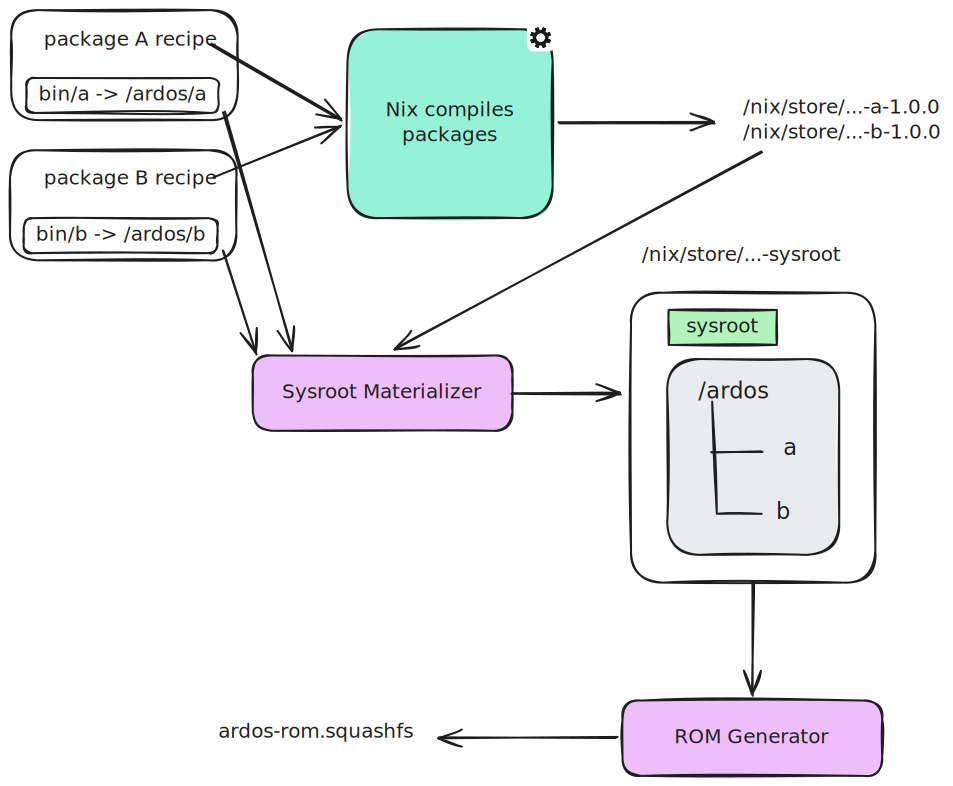
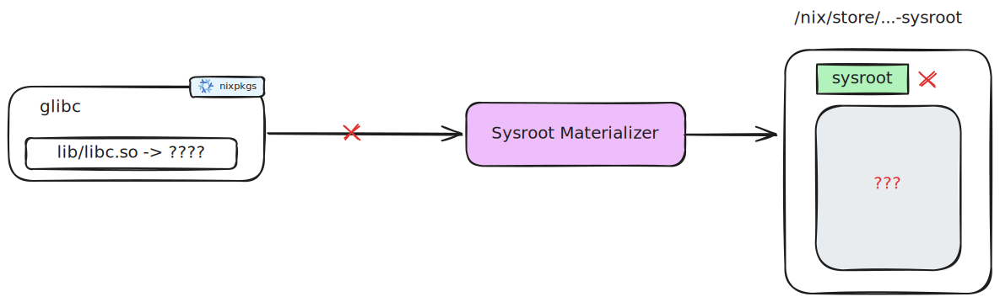

# Ardos Packer 2

This is a rewrite of [ardos-packer](https://github.com/ardos-os/ardos-packer) in the Nix language, prioritizing reproducibility,
isolated package builds, and better support for cross-compiling.

> WARNING: This is still experimental and unfinished so don't judge too soon.

## How is this even possible?

It might seem impossible since Nix is highly tied to the Nix store and NixOS runtime models. However, Nix is the perfect tool for building reproducible artifacts in a declarative manner. It gives you a full-blown functional programming language made specifically for package management, remote caching, reproducible builds, build sandboxing (cutting off internet and other impurities), explicit dependencies, and isolated builds. All one needs to build an Ardos OS image is Nix.

We can use the host's `nixpkgs` to build a cross-compiling toolchain targeting Ardos OS with all the libraries in the right places as it is implemented in [lib/toolchain/default.nix](lib/toolchain/default.nix).

The Ardos OS `stdenv` is built on top of the Nixpkgs `stdenv` frameworks; however, the toolchain is patched and overlayed to ensure everything is building correct Ardos OS binaries and libraries. In addition, \[nixpkgs itself is patched\](file:///lib/stdenv/patches/nixpkgs.patch) to make the generic builder recognize Ardos OS as a valid target.

This answers the building story, but how do we go from `/nix/store/gibberish` to clean Ardos OS paths inside the squashfs?

______________________________________________________________________

## Technical Architecture

The transition from the Nix store model to the final Ardos FHS runtime model relies on three key mechanisms: **Symbolic Link Mapping**, **Linker RUNPATH Translation**, and **Shebang Rewriting**.




### 1. Symbolic Link Mapping (`mkArdosDerivation`)

Nix store paths are treated strictly as a build-time implementation detail. Runtime locations are described declaratively by each Ardos package using `mkArdosDerivation`.

Each package defines a `runtimeLayout` list mapping Nix store outputs to target absolute paths inside Ardos:

```nix
mkArdosDerivation {
  pname = "hellolibrary";
  version = "0.1.0";
  runtimeLayout = [
    { source = "lib/libhellolibrary.so"; target = "/hellolibrary/libhellolibrary.so"; }
  ];
}
```

During the build, this mapping is stored as metadata in the package's output directory (`$out/nix-support/ardos-layout`). The `mkRuntimeTree` helper consumes this metadata to generate a separate derivation containing a materialized tree of symbolic links.

When the ROM generator constructs the final squashfs, it follows these symlinks to assemble the files at their final target paths, checking for collisions between packages.

------

#### Adding external non-ardos derivations


Some target packages come directly from nixpkgs and cannot reasonably be
changed just to add Ardos metadata.



`ardosPackerLib.init` therefore accepts an
`externalMappings` option: a list (or a function from `crossPkgs` to a list) of
`{ drv, runtimeLayoutScript }` entries. Each script has the same `$out` and
`$stage` interface as `mkArdosDerivation`, but it is evaluated outside the
derivation it describes. At link time, the setup hook only applies an external
mapping if that `drv` is actually present in the discovered dependency closure,
so generic mappings for packages such as libc or compiler runtime libraries do
not leak into unrelated outputs.

```nix
ardosPackerLib.init {
  inherit targetPlatform buildSystem;
  externalMappings = pkgs: [
    {
      drv = pkgs.glibc;
      runtimeLayoutScript = ''
        for so in "$out"/lib/*.so*; do
          [ -e "$so" ] || continue
          mkdir -p "$stage/ardos/lib"
          ln -sfn "$so" "$stage/ardos/lib/$(basename "$so")"
        done
      '';
    }
  ];
}
```

### 2. Linker RUNPATH Translation (`ld-wrapper-hook`)

Because compiled binaries must find their shared library dependencies (like `libc.so` or `libskia.so`) at runtime in their final Ardos paths (e.g. `/ardos/lib` or `/ardos/graphics`), we cannot let them retain Nix store references in their `RUNPATH` headers. At the same time, we must avoid running fragile tools like `patchelf` on final images.

To solve this, we overlay the cross-linker wrapper with a custom hook: [lib/builder/hooks/ld-wrapper.sh](/lib/builder/hooks/ld-wrapper.sh) (injector) + [lib/builder/hooks/ld-wrapper-impl.sh](lib/builder/hooks/ld-wrapper-impl.sh) (bash wrapper) + [lib/builder/hooks/ardos_ld_translate.rs](lib/builder/hooks/ardos_ld_translate.rs) (rust script with the actual argument translation).

- During package compilation, an Ardos setup hook aggregates all `runtimeLayout` maps of the package and its dependencies into a single translation file (`$ARDOS_RUNTIME_MAP`).
- The linker wrapper intercepts all `-rpath` flags and translates them:
  - If a path matches a Nix store location in the translation map, it is replaced with the target Ardos path (e.g., `/nix/store/.../lib` ➔ `/ardos/lib`).
  - If an RPATH points to an unmapped Nix store path (like bootstrap paths), it is **stripped** to prevent store leakage.
- The resulting ELF binaries are produced directly pointing to their runtime paths.

The injector + implementation setup is needed so changes to the implementation do not trigger unnecessary rebuilds to other derivations not using `mkArdosDerivation`. `stdenv.mkDerivation` sees a stub, and `mkArdosDerivation` injects the implementation path into the stub through an environment variable.

### 3. Shebang Rewriting (`ardosTranslateShebangs`)

Executable shell scripts in Nix typically have shebangs pointing to `/nix/store/...-bash/bin/bash`.

To run natively on Ardos, these shebangs must point to target packages that have runtime mappings (e.g., `/ardos/bin/bash`).
Our setup hook intercepts and parses all shebangs in the `postFixup` phase of target packages. Using the aggregated `$ARDOS_RUNTIME_MAP`, it matches the Nix store hash of the interpreter against declared layouts and rewrites the shebang path to point to the Ardos location (e.g., `#!/nix/store/.../bin/bash` ➔ `#!/ardos/bin/bash`).

______________________________________________________________________

## Development Workflows

We use `just` as our task runner. The task configuration is split into discoverable submodules:
```
[tiago@tiago-hp ardos-packer2]$ just
Available recipes:
    default              # Show all available recipes including submodules
    env target="default" # Enter development shell (default: toolset, or pass 'stdenv' for cross-compilers)
    start-ai             # Starts local ollama server and ollama client in a preset zellij layout
    build:
        check name arch="x86_64" target=arch # Runs a nix check exported from the flake outputs by name [alias: test]
        pkg name arch="x86_64" target=arch   # Build an package exported from the flake outputs by name

    fmt:
        md       # [alias: markdown]
        nix      # Format all Nix files in the repository using alejandra
        rs       # [alias: rust]
        sh       # [aliases: script, shell]
```
## Reliance on nixpkgs

You might say because we currently rely on nixpkgs recipes that Ardos OS is not fully independent from Nix OS, you're not
that far off. Even thought the structure of Ardos OS and Nix OS look nothing alike, it still feels wrong depending
on the same code Nix OS is built on.

We do have a plan to migrate over to our own derivations instead and completely break free from nixpkgs to manage the toolchain
and build packages targetting Ardos OS, but that's not just viable right now during this experimental phase.

## AI Usage

This is controversial so I'm already leaving here the disclaimer.

We do use a bit of AI, especially because nixpkgs is really complex and we do often run into issues because of something that happens behind the scenes we don't usually notice. Don't see the use of AI here as slop, it is being used to deal with puzzling issues
we just want to quickly get over with and deal with technical debt. All the code is still thourougly tested and audited for code quality both through unit tests, integration tests and manual tests.

The repository features a local LLM setup you can call with

```
just start-ai
```

If you have a beefy machine like a gaming PC, there's no need to beg billy G for tokens: you can download some local models and use
them with your favorite Agent CLI like codex, claude code and others, but expect to need at least 64GB of RAM/VRAM and a good
dedicated GPU (so VRAM goes vroom vroom because it doesn't share the same memory bus as the CPU) that supports vulkan (no need for surface extension) for a good experience.

If you have a weak machine with no option to host a minimally usable model for coding,
you'll have to use ollama cloud models, which are not bad at all and the plan is not that expensive. Codex works best with `minimax-m3:cloud` model if you use that, the other models tend to think too much or not understand how to work with codex tools well.
