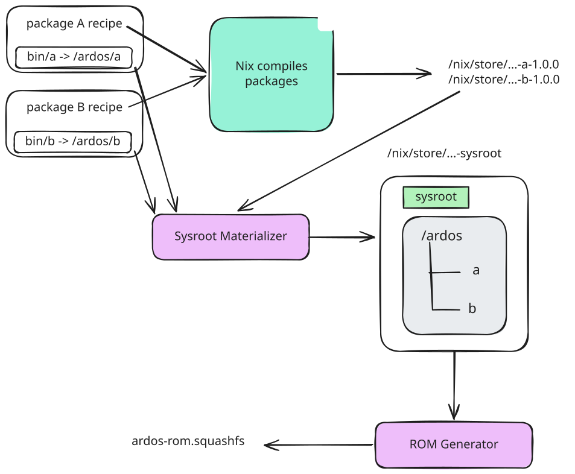

  

<h1 align="center">Ardos Packer</h1>

  
  

  <a href="https://ardos-os.github.io/ardos-packer2">Documentation</a>
  &nbsp;&nbsp;•&nbsp;&nbsp;
  <a href="https://github.com/ardos-os/ardos-packer2/issues/new">Issues</a>
  &nbsp;&nbsp;•&nbsp;&nbsp;
  <a href="https://github.com/ardos-os/ardos-packer2">Repository</a>

### [Read the docs →](https://ardos-os.github.io/ardos-packer2/getting-started)

## What is Ardos Packer?

Ardos Packer is the official build system of the [Ardos OS](https://github.com/ardos-os/ardos) operating system. It compiles the kernel, assembles the immutable system image, builds the initramfs, and boots the OS inside a QEMU VM for testing.

It is written in the Nix language, prioritizing reproducibility, isolated package builds, and better support for cross-compiling.

## How is this even possible?

It might seem impossible since Nix is highly tied to the Nix store and NixOS runtime models. However, Nix is the perfect tool for building reproducible artifacts in a declarative manner. It gives you a full-blown functional programming language made specifically for package management, remote caching, reproducible builds, build sandboxing (cutting off internet and other impurities), explicit dependencies, and isolated builds. All one needs to build an Ardos OS image is Nix.

The transition from the Nix store model to the final Ardos FHS runtime model relies on three key mechanisms: **Runtime Layout Mapping**, **Linker RUNPATH Translation**, and **Shebang Rewriting**.

The Ardos OS `stdenv` is built on top of the Nixpkgs `stdenv` framework. The toolchain is patched and overlayed to ensure everything builds correct Ardos OS binaries and libraries, and [nixpkgs itself is patched](lib/host/patches/nixpkgs.patch) to make the generic builder recognize Ardos OS as a valid target.

## Quick links

- Tutorials
  - [Build your first Ardos image](https://ardos-os.github.io/ardos-packer2/tutorials/first-build/)

- How-to guides
  - [Add a package to an Ardos image](https://ardos-os.github.io/ardos-packer2/how-to/add-package/)
  - [Use the Cachix binary cache](https://ardos-os.github.io/ardos-packer2/how-to/use-cachix/)
  - [Assemble the system image](https://ardos-os.github.io/ardos-packer2/how-to/assemble-image/)
  - [Run the image in a virtual machine](https://ardos-os.github.io/ardos-packer2/how-to/run-vm/)

- Reference
  - [Instance](https://ardos-os.github.io/ardos-packer2/reference/instance/)
  - [Builders](https://ardos-os.github.io/ardos-packer2/reference/builders/)

- Explanation
  - [About the build pipeline](https://ardos-os.github.io/ardos-packer2/explanation/build-pipeline/)

- Contributing
  - [Repository commands](https://ardos-os.github.io/ardos-packer2/contributing/commands/)

## Contributing

See the [repository commands](https://ardos-os.github.io/ardos-packer2/contributing/commands/) guide to start contributing to Ardos Packer.
